# 📱 Mediab  

A new **Flutter** project.

## 📸 Screenshots  

### 🖥️ Splash Screen  
<table>
  <tr>
    <td align="center"><b>🌙 Dark Mode</b></td>
    <td align="center"><b>☀️ Light Mode</b></td>
  </tr>
  <tr>
    <td>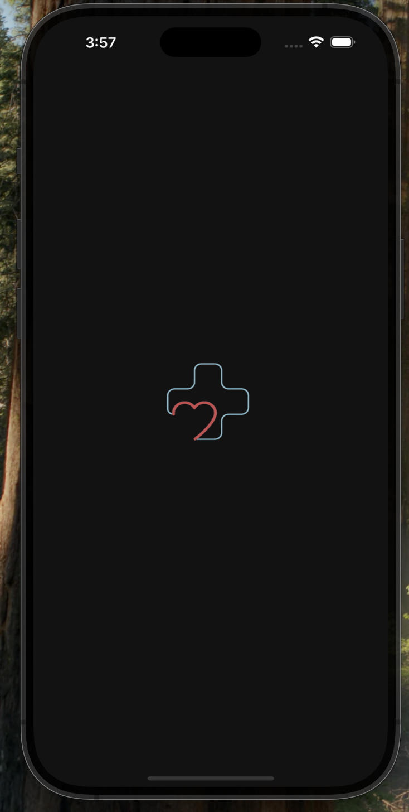</td>
    <td>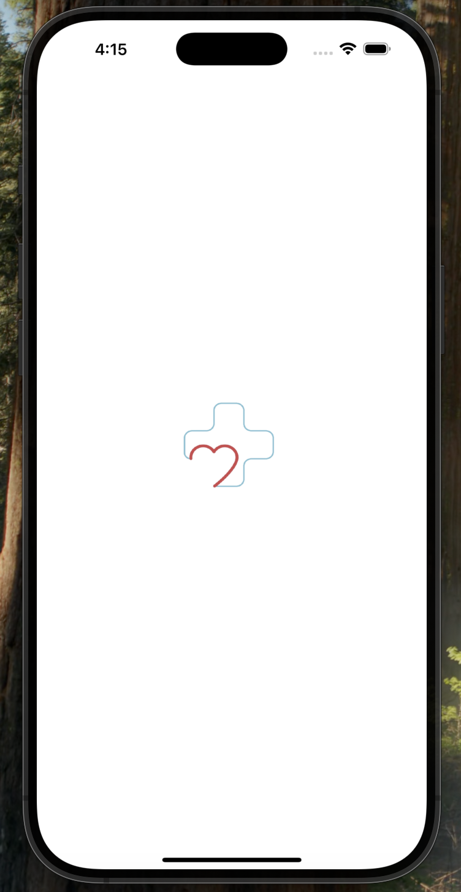</td>
  </tr>
</table>

---

### 🚀 Get Started Screens  
<table>
  <tr>
    <td align="center"><b>📌 Get Started 1</b></td>
    <td align="center"><b>📌 Get Started 2</b></td>
    <td align="center"><b>📌 Get Started 3</b></td>
  </tr>
  <tr>
    <td>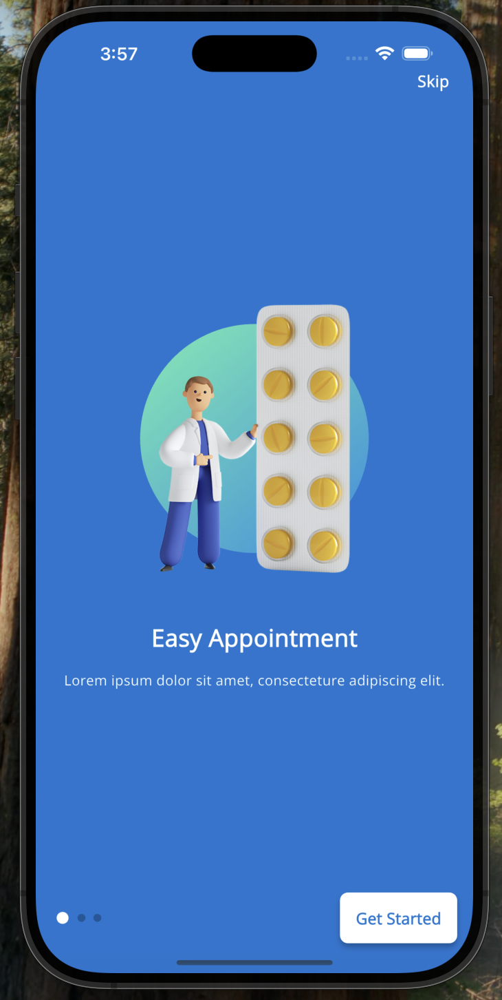</td>
    <td>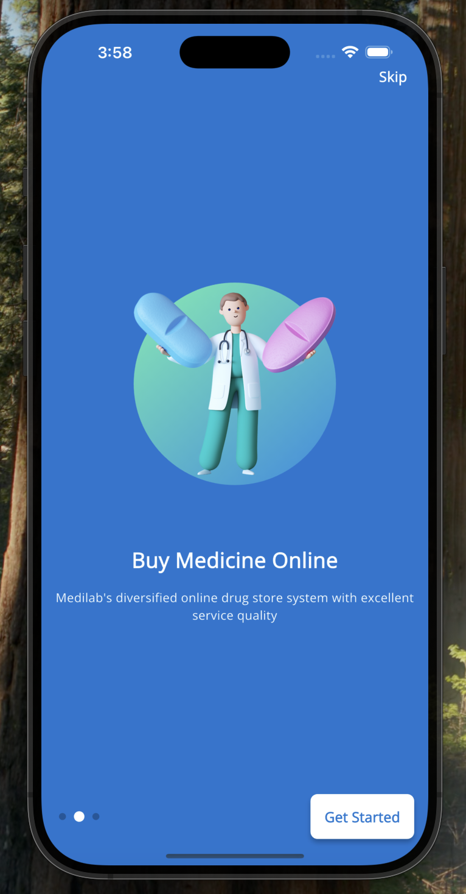</td>
    <td>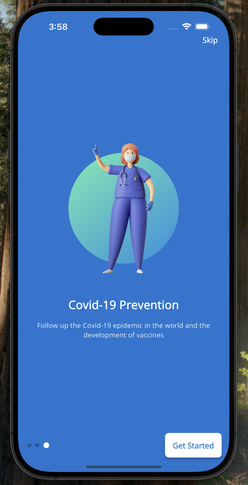</td>
  </tr>
</table>

---

### 🔐 Authentication Screens  
<table>
  <tr>
    <td align="center"><b>🔑 Login Screen</b></td>
    <td align="center"><b>📝 Register Screen</b></td>
  </tr>
  <tr>
    <td>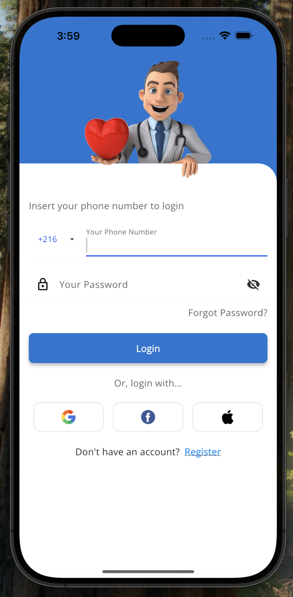</td>
    <td>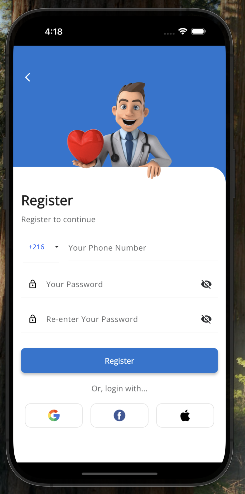</td>
  </tr>
</table>

---

### 🏠 Home Screen  
<table>
  <tr>
    <td align="center"><b>🌙 Dark Mode</b></td>
    <td align="center"><b>☀️ Light Mode</b></td>
  </tr>
  <tr>
    <td>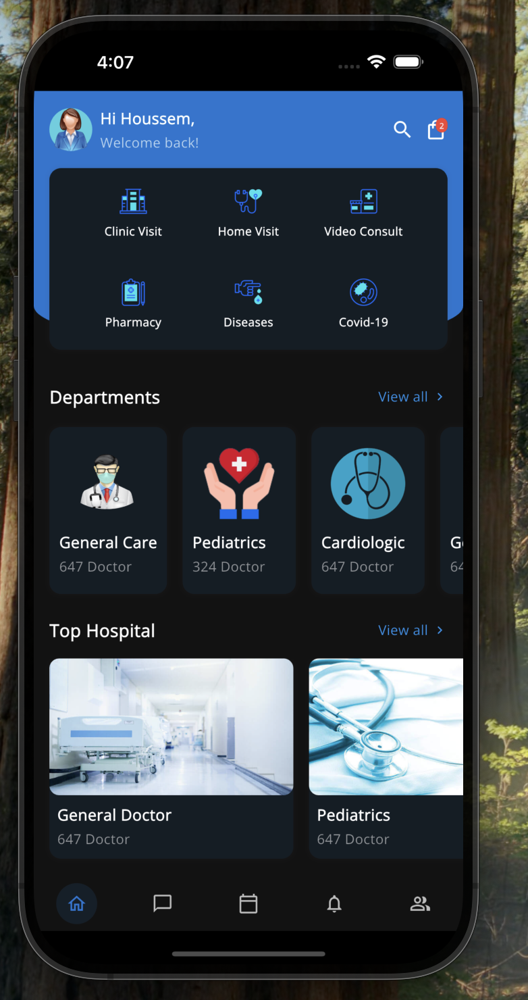</td>
    <td>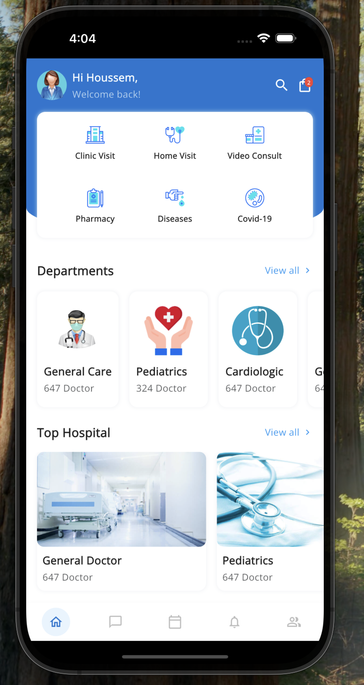</td>
  </tr>
</table>

---

### 👤 Profile Screen  
<table>
  <tr>
    <td align="center"><b>🌙 Dark Mode</b></td>
    <td align="center"><b>☀️ Light Mode</b></td>
  </tr>
  <tr>
    <td>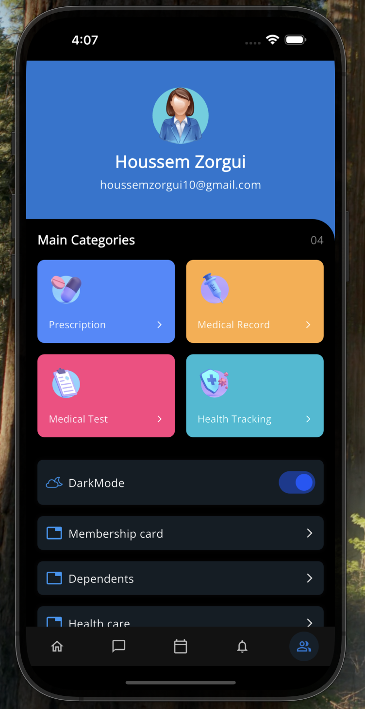</td>
    <td>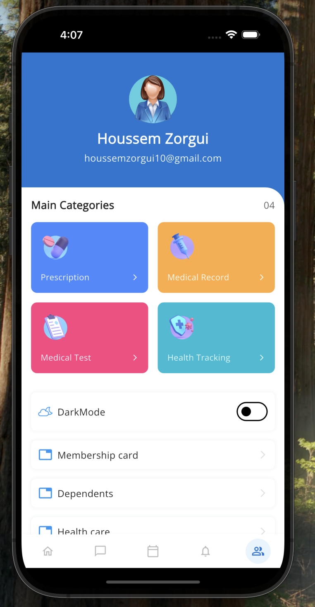</td>
  </tr>
</table>

---

## 🚀 Getting Started  

This project is a starting point for a **Flutter application**.

---

## 💙 Developed with Love  
Made with ❤️ by **Houssem Zorgui**  
